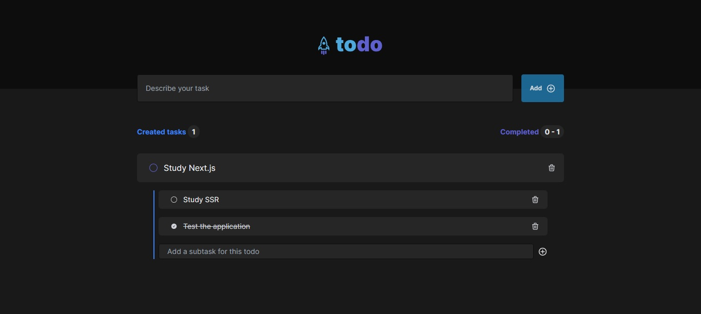

# TODO

This project is a front-end challenge, it's a `to-do list` developed with `Next.js`, `TypeScript` and `Tailwindcss`. You can add tasks and subtasks to each of them.

Run the application with `npm run dev` after install the dependencies with `npm install` or access the [app deploy](https://to-do-gui-leandro.vercel.app/)

**React hooks used:**
- useContext
- useReducer

**Tests with react-testing-library and vitest, you can run the tests with `npm run test` command.**
- Create a todo
- Select a todo
- Remove a todo
- Add subtask for todo
- Select todo subtask
- Remove todo subtask

  

<h4 align=center>Developed by <a href="https://www.linkedin.com/in/guirdy/">Guilherme Leandro</a> 💻</h4>
